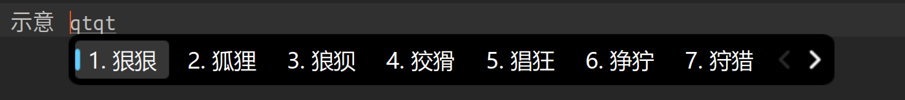

<div align="center">

# Fcitx5 Fluent Dark Theme

[English](#-english) | [简体中文](#-简体中文)

</div>

[](https://opensource.org/licenses/MIT)

---

<a name="-english"></a>

## 🇬🇧 English

A Fluent Design dark theme for Fcitx5, inspired by the Windows 11 Input Method Editor. It's designed to be clean, modern.



### ✨ Features

-   **Fluent Design:** Mimics the look and feel of Windows 11.
-   **Dark Mode:** Easy on the eyes.
-   **SVG-based:** Scales perfectly on HiDPI displays.

### ⚙️ Installation

#### 1. Manual Installation

1.  Download the latest release or clone this repository.
2.  Copy the `Fluent-Dark` directory to the Fcitx5 themes folder:
    ```bash
    cp -r Fluent-Dark ~/.local/share/fcitx5/themes/
    ```
3.  Right-click on the Fcitx5 tray icon, go to **Configure -> Add-ons -> Classic User Interface -> Theme**, and select **Fluent-Dark** from the list.
4.  Click **Apply** to see the changes.

#### 2. Git Clone Installation

For those who prefer to manage it with Git:
   ```bash
   git clone https://github.com/2doright/fcitx5-fluent-dark.git
   cd fcitx5-fluent-dark
   cp -r Fluent-Dark ~/.local/share/fcitx5/themes/
   ```
Then, select the theme in Fcitx5 configuration as described above.

### 📝 Font Configuration

This theme looks best with a font like **Microsoft YaHei UI**. To set the font:
1.  In the **Classic User Interface** configuration window, find the **Font** setting.
2.  Set the font to `Microsoft YaHei UI` or your preferred system font.
3.  Adjust the font size to your liking.

### 📄 License

This project is licensed under the **MIT License**. See the [LICENSE](LICENSE) file for details.

---

<a name="-简体中文"></a>

## 🇨🇳 简体中文

一个为 Fcitx5 设计的 Fluent Design 深色主题，灵感来自 Windows 11 输入法。旨在提供一个简洁、现代的体验。


### ✨ 特性

-   **Fluent Design 风格:** 模拟 Windows 11 的外观和质感。
-   **深色模式:** 舒适护眼。
-   **矢量图形:** 基于 SVG，在高分屏 (HiDPI) 上完美缩放。

### ⚙️ 安装

#### 1. 手动安装

1.  下载最新的 release 或克隆本仓库。
2.  将 `Fluent-Dark` 文件夹复制到 Fcitx5 的主题目录下：
    ```bash
    cp -r Fluent-Dark ~/.local/share/fcitx5/themes/
    ```
3.  右键点击 Fcitx5 托盘图标，进入 **配置 -> 附加组件 -> 经典用户界面 -> 主题**，在列表中选择 **Fluent-Dark**。
4.  点击**应用**使主题生效。

#### 2. 通过 Git 克隆安装

如果你习惯使用 Git 来管理：
   ```bash
   git clone https://github.com/2doright/fcitx5-fluent-dark.git
   cd fcitx5-fluent-dark
   cp -r Fluent-Dark ~/.local/share/fcitx5/themes/
   ```
然后按照上面的步骤在 Fcitx5 配置中选择主题。

### 📝 字体配置

本主题推荐搭配 **微软雅黑 UI** 字体以获得最佳观感。设置字体：
1.  在 **经典用户界面** 的配置窗口中，找到 **“字体”** 设置。
2.  将字体设置为 `Microsoft YaHei UI` 或你偏好的其他系统字体。
3.  根据你的屏幕分辨率调整字号。

### 📄 许可证

本项目采用 **MIT 许可证** 授权。详情请参阅 [LICENSE](LICENSE) 文件。
